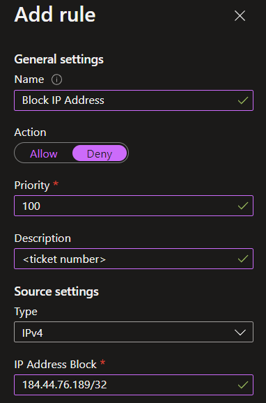

If malicious/suspicious user activity (scanning, auth attempts, etc.) is detected on an Azure App Service, blocking the source IP is often the quickest way to prevent further activity. To do so, it's as easy as adding a Network rule to the app service that blocks that IP/range.

### Requirements
- [Azure Az Powershell Module](https://docs.microsoft.com/en-us/powershell/azure/install-az-ps?view=azps-8.2.0)
```powershell
#Backticks for formatting
Add-AzWebAppAccessRestrictionRule `
-ResourceGroupName "ResourceGroup" `
-WebAppName "AppName" `
-Name "Ip example rule" ` #Friendly name of rule
-Priority 100 ` #If this app is publicly available, make sure this priority is lower than the priority of the 0.0.0.0/0 rule
-Action Deny `
-IpAddress 122.133.144.155/32
```
---
```powershell
#Same command one-liner
Add-AzWebAppAccessRestrictionRule -ResourceGroupName "ResourceGroup" -WebAppName "AppName" -Name "Ip example rule" -Priority 100 -Action Deny -IpAddress 122.133.144.155/32
```

## Doing things the old way
In the Azure web GUI, access the app service in question and click the "Networking" navigation blade on the left.  

Click "Access restriction"  
  

Click "Add rule"  


Give the rule a name, change the toggle to "Deny," set a priority for the rule (if this is a publicly available app service, make sure to set the new rule with a lower priority than the "Allow All" rule that exists (0.0.0.0/0), add the CIDR notation of the IP address in question, and click the "Add rule" button to save the changes. All traffic from that IP address will immediately be blocked.  
