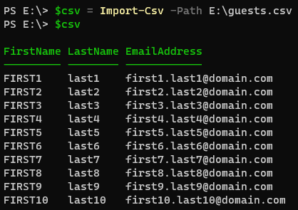
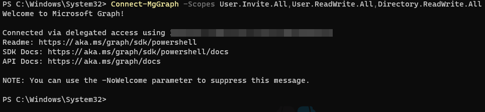
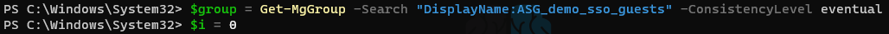
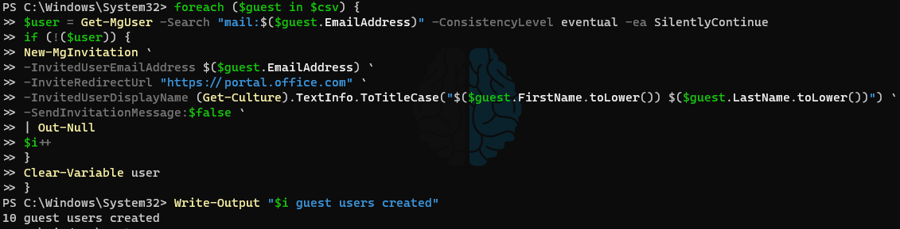
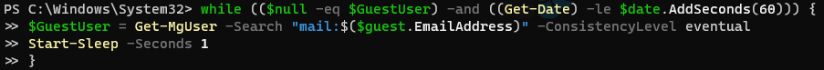
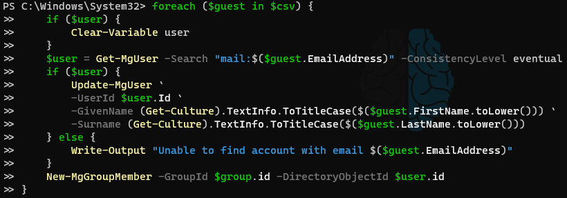

##### Update 01/10/24
Microsoft currently has a feature called [Multi-tenant Organization (MTO)](https://learn.microsoft.com/en-us/entra/identity/multi-tenant-organizations/multi-tenant-organization-overview) in public preview that manages the creation, enable/disabling, and deletion of Guest accounts between different tenants. Microsoft advertises an improved collaborative experience when working with users from the other organization ~~but, so far in my experience, while the automatic sync/management of Guest accounts is a plus - the collaborative experience is actually worse once MTO is involved.~~

##### Update 03/16/24
While MTO is still in preview, Microsoft has made great strides towards what I would consider a feature that is close to GA-ready. I have now been using MTO to sync roughly 5,000 total users between two tenants and despite some initial rockiness it has been smooth for the better part of 60 days. For end-users to be able to find each other in the GAL has been a widely praised feature and being able to leverage SSO configurations via Enterprise App means to allow users from the other tenant to SSO into a SaaS application now only requires a few minutes of effort rather than configuring SSO from scratch again (or worse, finding that the SaaS vendor only supports a single IdP). At the time of this writing, I would recommend MTO for any M&A scenario where users need to collaborate within MS Teams or access shared SaaS applications.


## Original post
Over the last decade or so, Microsoft has done a terrible job at addressing needs for Mergers and Acquisitions of medium to large businesses. They have provided almost no tooling and the features that exist often fall short of being production worthy in an M&A scenario. In many of these scenarios, there is often a business need to get the staff of a newly acquired company to access the parent company's existing platforms (HRIS, ERP, etc). For this, using EntraID (AzureAD) Guest accounts can often provide this access without having to complete a full identity migration of those users into the parent tenant.

EntraID B2B/Guest user accounts are a very powerful and flexible way to grant individuals outside of your primary tenant access to things as if they are within your tenant. A great example of this is Single SignOn (SSO) access to a third party SaaS application that you need contractors, or users from a newly acquired business, to access. Unfortunately (at the time of writing), even using the most modern methods for creating Guest Users like leveraging MS Graph does not allow for many attributes of a user account to be set at the time of creation; even attributes as basic as First Name or Last Name. These attributes are often passed through SSO configurations, like SAML or OIDC, as claims and are required for these Guest Users to be able to authenticate through SSO. Until Microsoft addresses this, the best course of action is to create all of the Guest Accounts and then take another pass through them to apply the necessary attributes. I recently had this scenario play out after my company acquired another and we needed all of their hiring managers and recruiters (about 300 in total) to access our SaaS recruiting platform. In this post, we will go over a script I wrote to handle all of the steps needed to complete this process.

### Prerequisites
* [Microsoft Graph Powershell Module](https://www.powershellgallery.com/packages/Microsoft.Graph)
* EntraID subscription
* Graph API permissions for `User.Invite.All`,`User.ReadWrite.All`, and `Directory.ReadWrite.All`

### Ingest list of users
The first thing I had the other company provide me was a CSV that contains the three key pieces of information we needed to for each user: FirstName, LastName, and EmailAddress. When I received it, I noticed that the FirstName was in all caps but for cleanliness' sake I didn't want these Guest Users to have names in all caps; we'll address this later in the script. (If you're ever sending data to be used programmatically, please don't be "that guy"; make sure the formatting is decent)



### Connect to MS Graph
Connecting to MS Graph using the Powershell module is pretty straight forward: `Connect-MgGraph`. One thing people tend to forget is to identify the permissions ahead of time that you'll need in order to perform the tasks at hand. For this, we will need `User.Invite.All`,`User.ReadWrite.All`, and `Directory.ReadWrite.All`.



### Declare variables
For SSO configurations, I always lock down the EntraID Enterprise App to only allow authentication for users in a particular Security Group. One thing to note here is that Guest Users can ONLY be added to a cloud security group and CANNOT be added to a security group that has been synced up from OnPrem AD via EntraID Connect. Adding these Guest Users to this cloud group is what grants them the ability within EntraID to authenticate against the Enterprise App and SSO. There's a few ways to grab this group using `Get-MgGroup` but I've found searching by display name to be the most convenient; in this case the group is 'ASG_demo_sso_guests.' We're setting `$i` to 0 now so we can use it as a counter to output the total number of Guest Users created.



### Creating the Guest Users
Guest user accounts are created by what MS calls an "Invitation." The default behavior when creating these is to send out an email invite that the user interacts with to accept. In most cases, this email causes confusion and generates helpdesk calls so I typically suppress it with `-SendInvitationMessage:$false`. As mentioned above, the CSV that was provided had users' first names in all caps but ideally users would have the first letter of each name capitalized. To fix this before creating the users, we leverage the `ToTitleCase` method of the `Get-Culture` cmdlet; this will capitalize the first letter lowercase the rest. I know this works well when location is set to US but I have not tested it outside of that. One nuance of `ToTitleCase` is that it assumes anything that is all caps is an acronym and doesn't change any of the casing. Since the first names in our CSV are all caps, we can get around this by converting the names to all lowercase while pulling them into `ToTitleCase`. The below foreach loop will confirm that a Guest User does not already exist for the email address then create a Guest User with the email address while converting the casing of the First and Last names to create the DisplayName (backticks used for formatting).



### Optional: While Loop
My experience has been that the time it takes for Guest Users to be created and available to make changes to varies pretty widely. I've seen them be available near-instant and I've seen them take 5-10 minutes. Personally, I did not include a `While` loop in my script to avoid it taking an extremely long time to complete but if you want a single repeatable script for creating Guest Users I would recommend one. As an example, here's one that will check for the existance of the Guest User account but, importantly, give up after 60 seconds.



### Adding the additional attributes and other changes
Now that the Guest Users exist, adding attributes is relatively simple and straight forward. Since we are making multiple changes to every user on this list (setting FirstName, setting LastName, and adding user to the security group), we will make all the changes as part of a single `foreach` loop. One thing to note is that while earlier we ensured to only attempt to create a Guest User if one didn't already exist, we want to make these next changes to every Guest User in the CSV, regardless of whether it existed prior. However, we also want to make sure that an output exists for any failures so we are made aware. Granted, since we're using the same CSV there should be no failures, but it's always good to throw in an extra line or two that helps the confidence of the script output.



### Put it all together
```powershell
$csv = Import-Csv -Path <path to csv>
Connect-MgGraph -Scopes User.Invite.All,User.ReadWrite.All,Directory.ReadWrite.All
$group = Get-MgGroup -Search "DisplayName:ASG_demo_sso_guests" -ConsistencyLevel eventual
$i = 0

foreach ($guest in $csv) {
    $user = Get-MgUser -Search "mail:$($guest.EmailAddress)" -ConsistencyLevel eventual -ea SilentlyContinue
    if (!($user)) {
        New-MgInvitation `
        -InvitedUserEmailAddress $($guest.EmailAddress) `
        -InviteRedirectUrl "https://portal.office.com" `
        -InvitedUserDisplayName (Get-Culture).TextInfo.ToTitleCase("$($guest.FirstName.toLower()) $($guest.LastName.ToLower())") `
        -SendInvitationMessage:$false `
        | Out-Null
        $i++
    }
    Clear-Variable user
}
Write-Output "$i guest users created"

<# OPTIONAL to be incorporated in the foreach loop
$date = Get-Date
while (($null -eq $GuestUser) -and ((Get-Date) -le $date.AddSeconds(60))) {
    $GuestUser = Get-MgUser -Search "mail:$($guest.EmailAddress)" -ConsistencyLevel eventual
    Start-Sleep -Seconds 1
}
#>

foreach ($guest in $csv) {
    if ($user) {
        Clear-Variable user
    }
    $user = Get-MgUser -Search "mail:$($guest.EmailAddress)" -ConsistencyLevel eventual
    if ($user) {
        Update-MgUser `
        -UserId $user.Id `
        -GivenName (Get-Culture).TextInfo.ToTitleCase($($guest.FirstName.toLower())) `
        -Surname (Get-Culture).TextInfo.ToTitleCase($($guest.LastName.toLower()))
        New-MgGroupMember -GroupId $group.id -DirectoryObjectId $user.id
    } else {
        Write-Output "Unable to find account with email $($guest.EmailAddress)"
    }
}
```