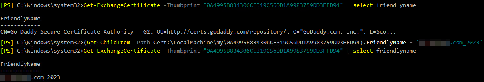

If you use a wildcard certificate on your onprem Exchange server, it is common that the CSR and certificate are generated outside of the Exchange environment and you are importing it into Exchange. If that's the case, you don't get an option for changing the Friendly Name of the certificate during the import process. This can result in Exchange listing multiple certificates with the same name on the Certificates page in ECP.


### Changing friendly name
You would think that Microsoft would provide an intuitive way to change the friendly name of a certificate either within the ECP web GUI or at least through Powershell cmdlet. Unfortunately, `Set-ExchangeCertificate` does not exist and ECP does not give any options to modify the friendly name. Luckily, there is a quick and easy (albeit a bit unintutiive) way to change the friendly name of an Exchange certificate by leveraging a cmdlet that you wouldn't expect to permanently change any attribute: `Get-ExchangeCertificate`. To do this, just access the FriendlyName attribute of the certificate in question and set/force the name you want in its place; I name my certificates with the Subject Name followed by the expiry year.


### Alternative method
I have come across a couple scenarios where for some reason the above method didn't work. The command wouldn't output any errors, but the certificate just would not have a different friendly name afterwards. In those few examples, I used a slightly different method to accomplish the same thing. For this, we're effectively doing the same thing but instead of using Exchange, we're just leveraging Powershell's `Get-ChildItem` to objectify the certificate we want.
#

Keeping clear friendly names will help differentiate certificates no matter how those certificates are being viewed and avoid confusion for others on your team!

### Code
```powershell
(Get-ExchangeCertificate -Thumbprint "<thumbprint>").FriendlyName = '*.domain.com_2023'
#or
(Get-ChildItem -Path "Cert:\LocalMachine\my\<thumbprint>").FriendlyName = '*.domain.com_2023'
```