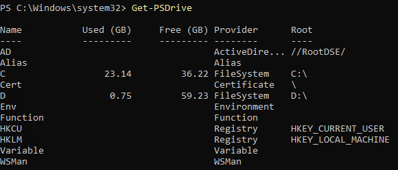
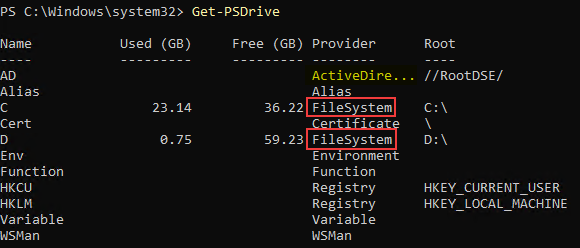
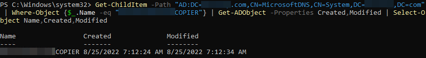

Be honest, your onprem DNS is probably a bit of a mess. I've yet to encounter an organization that doesn't have old/stale records in their onprem Active Directory integrated DNS; even when DNS scavenging is enabled. Sometimes this is a lack of time spent on housekeeping within DNS (*raises hand*: "guilty!"), other times it's because nobody is quite sure how long that DNS record has been around to identify whether it can be deleted or not. We can use Powershell to identify DNS records `Created` and/or `Modified` date to help answer some questions about whether it can be deleted. However, the traditional DNS Powershell cmdlets (`Get-DnsServerResourceRecord`, etc.) will not output any information regarding `Created` or `Modified`. Instead, we will leverage the Active Directory database behind the scenes to get these attributes.

### Finding specific DNS objects
By default when the Active Directory Powershell Module is installed/imported (either on a Domain Controller or when RSAT Tools are installed), Powershell recognizes "AD:" as a valid drive and this can be used to browse the AD database. To see the different drives that Powershell will recognize, run `Get-PSDrive`.


We can use `Get-ChildItem` to iterate through objects in this "drive" and output attributes of those objects; including the `Created` and `Modified` attributes. Typically, `Get-ChildItem` is used in conjuction with File Systems (network drives, local drives, etc.) so under common cirumstances I would [always recommend using the `-Filter` parameter](/post/improve-powershell-runtimes-using-filter-parameter/) for that cmdlet when trying to grab specific objects; this cuts WAY down on the amount of time it takes an object to be returned. However, per [Microsoft Documentation for that parameter](https://learn.microsoft.com/en-us/powershell/module/microsoft.powershell.management/get-childitem?view=powershell-7.2#-filter), *"The FileSystem provider is the only installed Powershell provider that supports filters."* As you can see below, our AD: drive does not have a `Provider` of FileSystem, so we cannot use the `-Filter` parameter for this. My DNS environment has a little over 11,000 records so it's not a huge loss, but for extremely large environments it could hurt.


Assuming that we're not looking to output all records (scroll down for more on that), we can leverage `Where-Object` to only output the objects based on the criteria we want. For this, we specify the path of our `Get-ChildItem` function to the DNS path inside the aforementioned AD "drive," pipe that to `Where-Object` to specify the criteria we're looking for (in this case "Name"), then pipe that to Get-ADObject to output the `Created` and `Modified` attributes of that object in the AD database.  

```powershell
Get-ChildItem -Path "AD:DC=domain.com,CN=MicrosoftDNS,CN=System,DC=domain,DC=com" | Where-Object {$_.Name -eq "<record name>"} | Get-ADObject -Properties Created,Modified | Select-Object Name,Created,Modified
#or
Get-ChildItem -Path "AD:DC=domain.com,CN=MicrosoftDNS,CN=System,DC=domain,DC=com" | Where-Object {$_.Name -like "*<keyword>*"} | Get-ADObject -Properties Created,Modified | Select-Object Name,Created,Modified
```

### Output all DNS objects
If you want to output the created and/or modified date of every DNS object in the AD environment just remove the `Where-Object` function from the pipeline. Given how many objects are likely going to be returned, you will likely want to pipe that to `Export-Csv` to ensure that you have a readable file rather than having it all dump to the Powershell console.
```powershell
Get-ChildItem -Path "AD:DC=domain.com,CN=MicrosoftDNS,CN=System,DC=domain,DC=com" | Get-ADObject -Properties Created,Modified | Select-Object Name,Created,Modified | Export-Csv -Path $env:USERPROFILE\Downloads\AD_DNS.csv -NoTypeInformation
```