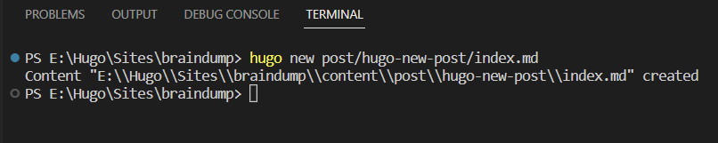
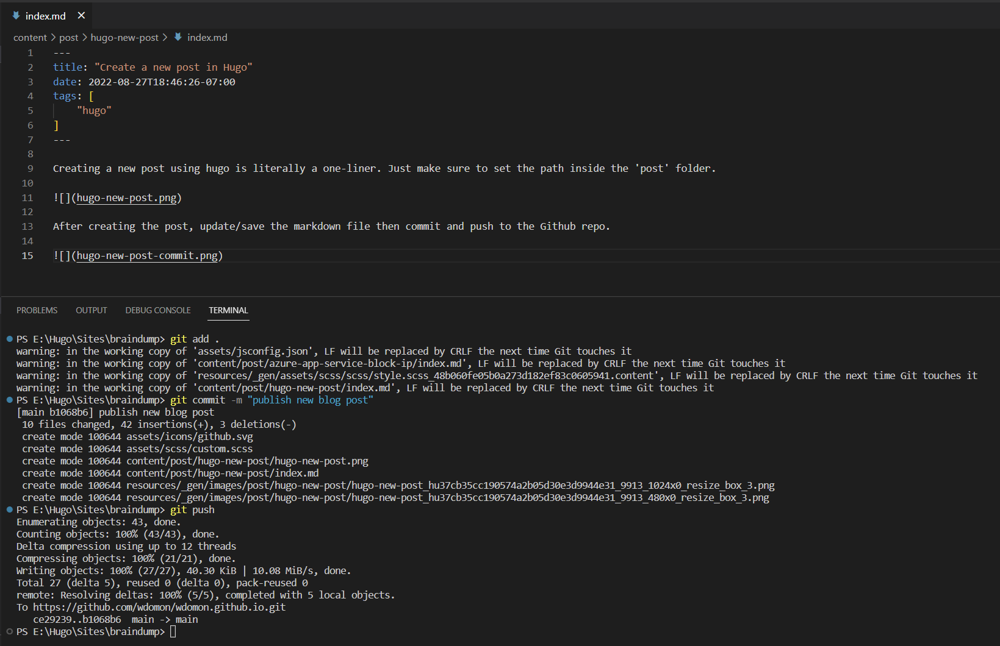

Creating a new post using [hugo](https://gohugo.io/) is literally a one-liner. Just make sure to set the path inside the 'post' folder.

After creating the post, update/save the markdown file then commit and push to the Github repo.

