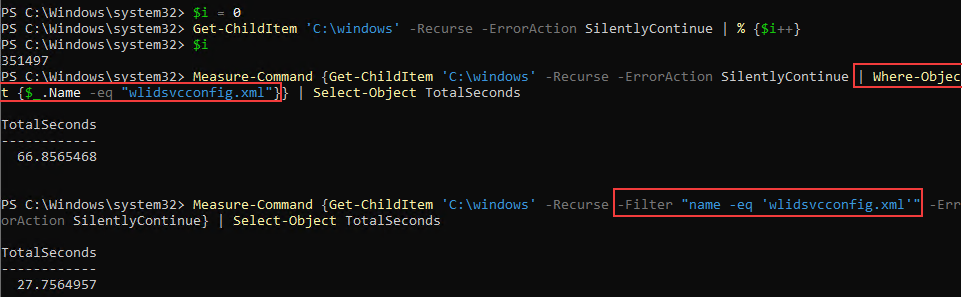

When working with larger datasets in Powershell it can take a while to output the data that you want. One of the first concepts Powershell users learn is the use of the `Where-Object` function to pipe data in and limit the output to just the data they are looking for. When working with small datasets, this works totally fine and is widely used. One important nuance of this function, though, is that it needs to wait for all of the data to be piped into it first, then it identifies the objects that match the criteria, and then finally outputs those objects. With larger datasets this can end up taking an extremely long time and if we're only looking for a specific object or set of objects we can drastically reduce the time it takes to output what we want if we instead use the `-Filter` parameter of functions that support it.

As an example, you can see below that there are 351,497 items underneath C:\Windows. If we use `Get-ChildItem` and were to try to output only a single file named "wlidsvcconfig.xml" using `Where-Object` it has to wait for all 351,497 of those objects to be passed through the pipeline before it can output the file we're looking for. If we use `-Filter` then it the function will only get objects that match the filter criteria and then pass those through the pipeline. There is still computational load to identify the objects that match the criteria, but it is always going to be significantly less than waiting for all of the objects to be returned first and then having `Where-Object` look at them. Using this example, it takes less than half the time (27.76 seconds versus 66.86 seconds) to accomplish the same thing.

