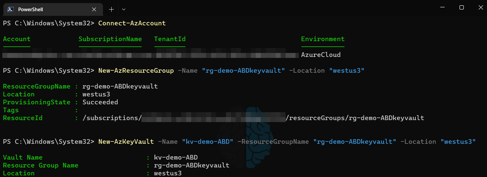
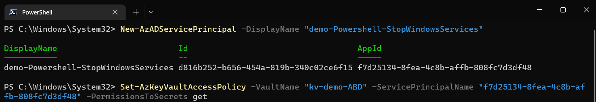
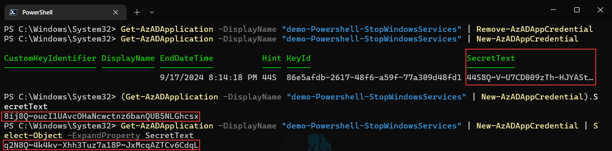
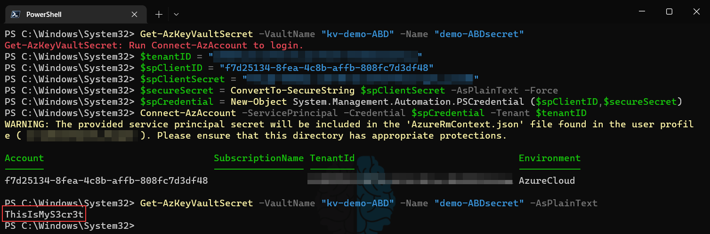
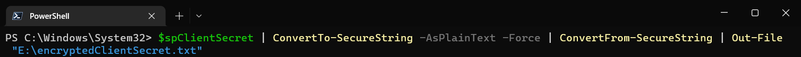
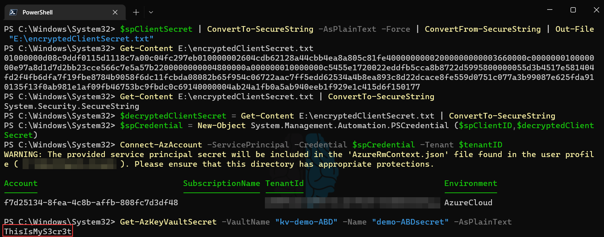

In light of the recent news that [Uber was hacked](https://arstechnica.com/information-technology/2022/09/uber-was-hacked-to-its-core-purportedly-by-an-18-year-old-here-are-the-basics/) largely in part due to a highly privileged credentials being stored in a Powershell script in plain text, I figured some admins writing Powershell might be scrambling to finally level up their secret game. There are lots of ways to store your credentials for Powershell scripts (and effectively _all_ of them are better than plain text); each with their own list of pros and cons, but I'll share one way that provides a layered approach to protecting the secrets while also the flexibility to use those secrets on-prem or in the cloud.

# Prerequisites
* [Azure Az Powershell Module](https://learn.microsoft.com/en-us/powershell/azure/install-az-ps?view=azps-8.3.0)
* Azure subscription
* Access to create Azure KeyVault and grant access controls to it
* Access to create AzureAD Service Principals (App registration)

# Store the actual secrets in Azure KeyVault
The actual usernames/passwords needed by the script to perform operations will be stored in Azure KeyVault. This allows for granular/RBAC permissions to be granted to secrets within Azure as well as a way to separate the credentials so scripts do not have access to more than they need. Anytime you are creating a new workload, function, group of tasks, etc. I recommend to put them in their own resource group. This helps organize things but also helps with applying specific Azure Policy to specific resources. In this example, I create a new resource group and then a new KeyVault to be used for these secrets.

# Create a Service Principal
Now that the KeyVault exists we need to limit who can access the secrets inside. For this we will be creating a service principal by way of an Azure App registration. The naming convention you use for app registrations may vary, the important part here is to differentiate between scripts as each script/task will have it's own Service Principal. Doing so ensures that each script has it's own individual authentication mechanism so logs will clearly indicate which process was authenticating. At this point, you may be thinking that it would be convenient to have one KeyVault with all of your credentials in it and then limit Service Principals to only being able to read the credentials they need. Sadly, Microsoft does not provide a way to set permissison on individaul keys or secrets within a KeyVault; only to the KeyVault itself. As a result, we create a separate KeyVault for each script (though we can keep them all in one Resource Group). We do this so if somehow the service principal was ever compromised that it does not hold the keys to the kingdom, only to the couple of secrets it needs to run and only the ability to read that secret, not modify/delete. Does this make it a pain when we rotate/change passwords? Absolutely, but doing things the "right" way is typically a pain when compared to the alternative.

Create a new Service Principal and note the `AppId` output. Then, create a new KeyVault Access Policy that grants "get" permissions for secrets in the desired KeyVault using the aforementioned `AppId` value for the `ServicePrincipalName` parameter. This value can also be found for existing Service Principals by looking at the `AppId` or `ServicePrincipalName` attributes of that object using `Get-AzADServicePrincipal` cmdlet.

# Create a Client Secret
The Service Principal now has access to the KeyVault, however we still need a way to use (authenticate as) the Service Principal. Azure automatically creates a Client Secret when you create a new Service Principal. However, when you create it via Powershell you are not presented with what that Client Secret is, and by design you can never recover it again. As a result, I make it a habit to just delete the one Azure creates immediately after I create a Service Principal and create a new one. Because Client Secrets cannot be accessed ever again once they're created, it's important that you account for this when building a new one. As you can see in the example below if you just create a new Secret the `SecretText` attribute can actually be truncated in your Powershell console and you will not be able to get the full value ever again. As a result, if you are building this interactively be sure to either encase the command in parenthesis and call the `SecretText` attribute, or use `Select-Object` to expand the property (my preference).

# Connection in Powershell Script
Now all that is left is to tell our Powershell script to authenticate into the Azure tenant AS that Service Principal and then access the Secret in that KeyVault. The first step for this is to obtain the Tenant ID if you don't already have it. The easiest way to do this is when connected to Azure via Powershell just run `(Get-AzContext).tenant.id` and it will return the ID you need. Once you have this, you connect using the method below by using your Service Principal Name (aka `AppId`, or `ClientID`) and the Client Secret. The first line shows that I am not connected to the tenant and the last line shows the that I was able to output the secret in plain text after authenticating as the Service Principal.

# What's the difference?
Great, so we now have the ability to let our Powershell scripts authenticate to Azure KeyVault to obtain passwords and secrets. But as many people tend to point out at this stage, aren't we just putting the "Client Secret" in plain text in the script? And isn't that basically just a password as well? Yes and yes. While keeping the password itself out of plain text and in Azure KeyVault instead is definitely more secure, it's just a small hurdle for an attacker to jump through to get the password. The second step here is what helps lock this down in a much more secure way: Encrypting the client secret in a local file on the server running the Powershell script. This is done by leveraging the Data Protection API (DPAPI) built into the Windows Server OS. When this API is used to encrypt a file there are two key requirements that must be met that we take advantage of:
1. The decryption request must come from the user account that was used to originally encrypt it.
2. The decryption request must come from the Windows Server OS that was used to originally encrypt it.
This means that if an attacker were able identify that this file holds the Client Secret (let's say by locating the Powershell script and seeing a connection string like in the case of Uber's hack), they could not decrypt the file unless they were logged into the server that originally encrypted the file and ALSO logged in as the user that originally encrypted the file. The catch here is that you must run the scheduled task that is launching the script as the same user that you use to generate the encrypted file; for this use a service account that has no permissions to anything on the network other than the file path it writes this encrypted file to.

# Encrypting the local file
Encrypting data in a local file is is quite easy and only takes a couple of lines. First we take the variable we used earlier that is just a plain text string containing the Client Secret; we convert it TO a secure string and then back FROM a secure string and dump that to a text file.

# Using/decrypting the local file

Rather than go into detail as to how this works, there is a [quick writeup from the folks at PDQ on this topic specifically](https://www.pdq.com/blog/secure-password-with-powershell-encrypting-credentials-part-1/) that you can read if you're interested. Once the file exists, that it is! It's encrypted by the Windows DP API and decrypting it in scripts (that run as the same user account that encrypted it) is as easy as just `Get-Content -Path <path to file> | ConvertTo-SecureString`. As you can see below, if you read the contents of the text file it is just a long string of alphanumeric characters. To make it usable in a script, you just create a credential object using the ClientID and the decrypted Client Secret and use that when connecting to Azure as the Service Principal!

