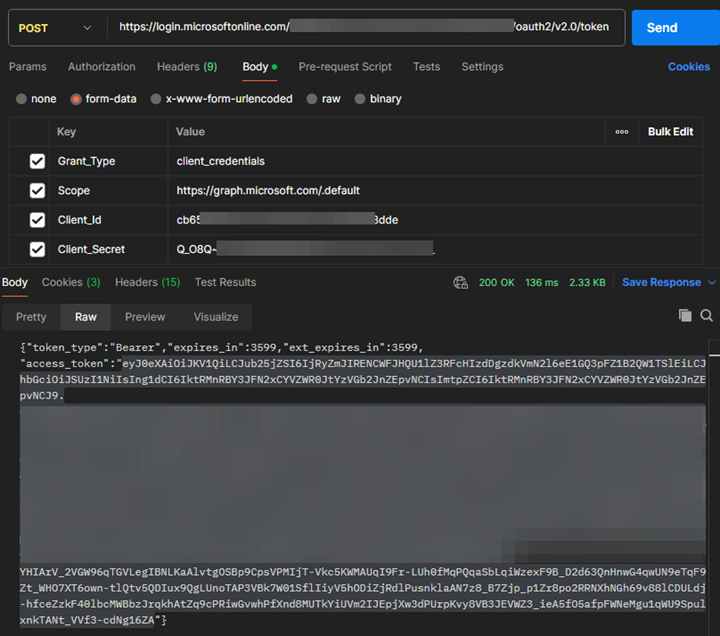
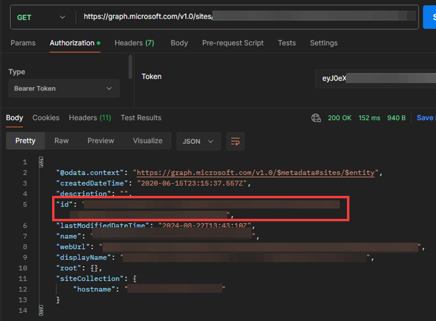
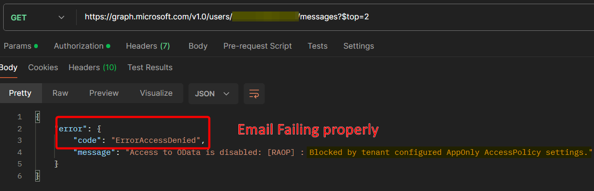
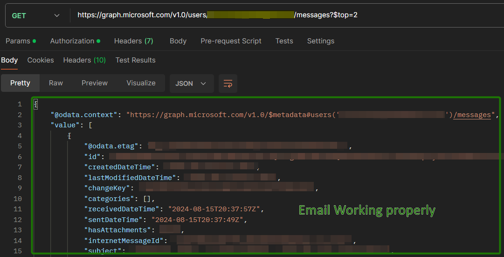
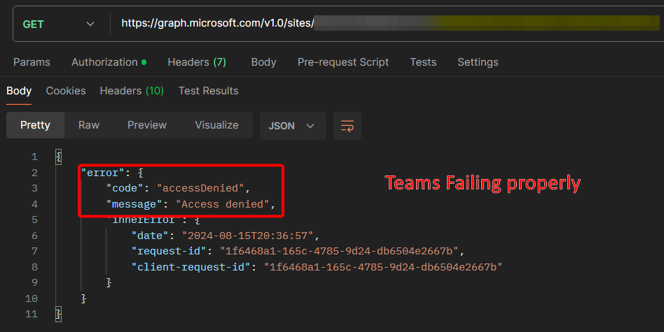
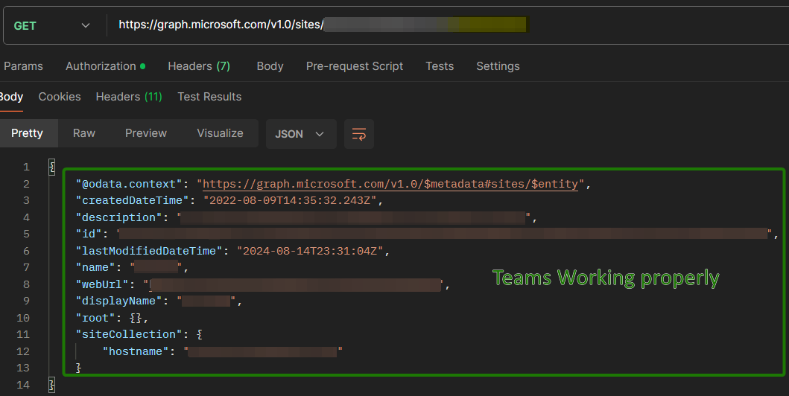

Graph API permissions via EntraID app registrations have become even more popular over the last couple of years. While they are definitely an upgrade over old school "service accounts," granting an app access to an Exchange Online(EXO) mailbox or a Teams/Sharepoint Online(SPO) site using Graph API permissions can result in far more permissions being granted than are needed (or realized).

Many 3rd party applications/vendors, and even flows built within your own Power Automate tenant, etc. will request an app registration with a list of Graph API permissions that their app "needs." If this app requires the ability to access a single mailbox, for example, they will request `Mail.Read` or `Mail.ReadWrite` as the application permission they need. However, what some people don't pick up on is that this is actually granting this app permission to access EVERY mailbox in the entire tenant; shared mailboxes, user mailboxes, resource mailboxes, the CEO/CFO's mailbox... you get the point. Granting `Sites.Read.All` or `Sites.ReadWrite.All` do the same for every Teams/OneDrive/SPO site as well. Luckily, Microsoft has introduced features in Microsoft Graph that provide more granular control over app access to specific SPO/Teams site collections and Exchange Online mailboxes. This post will walk you through the process of configuring these features to ensure that your applications only have access to the necessary resources.

### Scoping Microsoft Graph Permissions for Exchange Online Mailboxes
A significant enhancement is the ability to scope Microsoft Graph permissions to specific Exchange Online mailboxes using the Application Access Policy feature. This is particularly useful in scenarios where an app needs to access only a subset of mailboxes within an organization. This feature is actually just a configuration within EXO using the [ExchangeOnlineManagement](https://www.powershellgallery.com/packages/ExchangeOnlineManagement/3.5.1) Powershell module and not with MS Graph itself.

#### Configure Application Access Policy
1. Connect to Exchange Online PowerShell: First, connect to Exchange Online PowerShell. You can use the Azure Cloud Shell or any other preferred method to do this.

2. Identify the App and Security Group: Identify your app’s clientID and either create a new mail-enabled security group or use an existing one; identify the email address of this group. This group will be used to control the app's access to specific mailboxes. You will add the user account for each mailbox the app needs to access as members of the group (including the disabled accounts associated with shared mailboxes).

3. Create an Application Access Policy: Run the following command to create a policy that restricts the app’s access to the mailboxes within the specified security group
   ```powershell
   $appId = <insert clientID of app registration>
   $groupId = <insert email address of mail-enabled security group>
   
   New-ApplicationAccessPolicy -AppId $appId -PolicyScopeGroupId $groupId -AccessRight RestrictAccess -Description "Scopes down appregX to just mailboxes in groupY"
   ```
   **NOTE: This often takes 1-2 hours to take effect once created**

As you can see, the restriction is actually behing handled by Exchange so the app still has the broad permissions that were originally requested but in practice it will get an "Access Denied" if it tries to access any mailbox that is not in the group. By using this policy, you can ensure that your application only accesses the mailboxes that are explicitly needed, improving your organization’s security and compliance posture.


### Restricting App Access to Teams/SharePoint Online Site Collections
As mentioned previously, granting application permissions for SPO/Teams via Microsoft Graph was an all-or-nothing proposition, with apps having access to all site collections within a tenant. However, Microsoft has introduced a new permission called `Sites.Selected`, which allows administrators to limit app access to specific site collections. Unlike the access policy outlined above, this is done within MS Graph itself by replacing the requested `Sites.Read.All` or `Sites.ReadWrite.All` permissions with the `Sites.Selected` instead.

#### Steps to Configure Access:
While technically granting your application access to a particular site collection only requires a single API call, there's a process that you'll need to follow in order to accomplish that call:

1. **Assign the `Sites.Selected` Permission**:
   Begin by assigning the `Sites.Selected` permission to your application. This can be done in the EntraID app registration portal. By default, this permission does **NOT** grant access to any site collections.

2. **Create/use an app registration that has `Sites.FullControl.All` (appregA)**
   - This will be used to APPLY the permission to the restricted app registration
   - A temporary app registration can be created for this as long as it is deleted afterwards

3. **Create/identify an app registration that has Sites.Selected (appregB)**
   - This will be granted the API permission to the targeted Teams/SPO site(s)

4. **API call to output an access token for appregA**
   - Type: `POST`
   - Uri: `https://login.microsoftonline.com/<tenantId>/oauth2/v2.0/token`
   - Body
     - Grant_Type: `client_credentials`
     - Scope: `https://graph.microsoft.com/.default`
     - Client_Id: `<clientID fo appregA>`
     - Client_Secret: `<clientSecret of appregA>`
     

6. **Copy value of "access_token" in response**

7. **API call to find "siteID" of Teams/SPO site(s) wanting to allow an app registration to**
   - Type: `GET`
   - Uri: `https://graph.microsoft.com/v1.0/sites/uticorp.sharepoint.com:/sites/<displayNameOfSite>`
   - Authorization: `"Bearer <access token for appregA>"`

8. **Copy middle value of "id" in response**
   - "id" in response will contain a comma-separated string and the siteID is the middle value
   - Example: 

9. **API call to apply Teams/SPO site permissions to appregB**
   - Type: `POST`
   - Uri: `https://graph.microsoft.com/v1.0/sites/<siteID>/permissions`
   - Authorization: `"Bearer <access token for appregA>"`
   - Body:
        ```text
        {
            "roles": ["write"],
            "grantedToIdentities": [{
            "application": {
                "id": "<clientID of appregB>",
                "displayName": "<DisplayName of appregB>"
            }
            }]
        }
        ```
        Insert the clientID and DisplayName of appregB in the above body and the siteID in the Uri with the ID of the site collection you want to grant access to. Microsoft provides the following roles:
        | Role Name     | Description                            |
        | ------------- | -------------                          |
        |               |                                        |
        | read | Read-only                                       |
        | write | Adds Write and related bits                    |
        | manage | Adds Manage Lists / Designer and related bits |
        | fullcontrol | All permissions                          |

If access to more than one site is needed, just call the permissions endpoint for each site and respective role the app registration needs.

While obviously this is more cumbersome than granting the originally requested permission, this approach provides a more secure method of managing application permissions, ensuring that apps only interact with specific site collections, thus reducing the risk of unauthorized access.

### Examples





