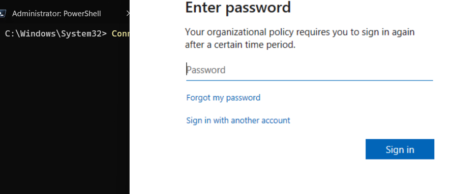

Sharepoint Online (SPO) management tools provided by Microsoft leave something to be desired, to say the least. The admin center web GUI is missing an enormous amount of functionality and the Powershell module is pretty unintuitive. While I don't use a ton of SPO, I recently migrated a site to a different M365 tenant and had the need to set that site to a Read-Only state for a period of time (to ensure we had something to reference in the event someone reported that something was missing) and then disable access to it entirely. Using the SPO Powershell Module, you can quickly and easily change the `LockState` attribute of an SPO site.

First connect to SPO using the administrative URL of your M365 tenant using the [Connect-SPOService](https://docs.microsoft.com/en-us/powershell/module/sharepoint-online/connect-sposervice?view=sharepoint-ps) command. The administrtive URL you connect to is always the same format:  
`Connect-SPOService -Url https://tenantname-admin.sharepoint.com` 

  

Once connected, set the `LockState` property of the site accordingly using the [Set-SPOSite](https://docs.microsoft.com/en-us/powershell/module/sharepoint-online/set-sposite?view=sharepoint-ps) command. This property can accept three values:
* `Unlocked` - Default state, site is available
* `ReadOnly` - Site is in a view only state so no changes can be made. A message appears at the top of the site indicating that the administrator is preventing any changes from being made to this site. Permissions of folders can be viewed but whether or not those permissions are inheriting
* `NoAccess` - Disables the site entirely. If the tenant has a value for `NoAccessRedirectUrl` then all traffic will be forward to that URL. If that value is not set, then a 403 error will be returned for all visitors of the site.
```powershell
Connect-SPOService -Url "https://tenantname-admin.sharepoint.com"
Set-SPOSite -Identity "https://tenantname.sharepoint.com/sites/Company" -LockState "ReadOnly"
```